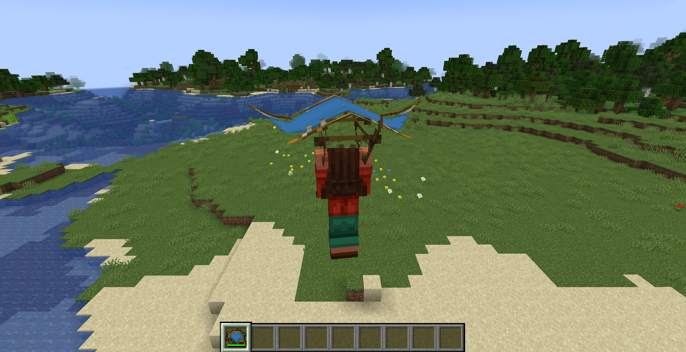
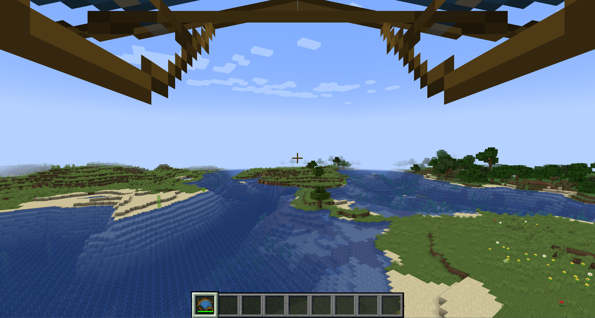
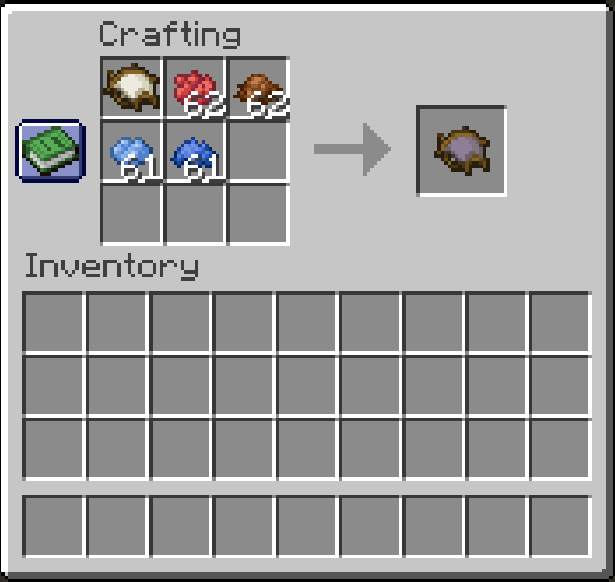

# Reliable Gliders

A mod that adds a simple, immersive, and balanced Glider to the game!

## Features

* **Easy Gliding!** Simply hold the Glider in your main hand or off-hand and jump to activate it! It will drastically
  slow your fall and allow you to cover far distances.
* **Configurable Updrafts:** Gliding over blocks tagged with `reliable_gliders:updraft_blocks` (default: Fire, Lava, and
  Campfires) will give you a small boost.
* **Dyeing**: Gliders can be dyed similar to Leather Armor for extra personalization!
* **Durability**: The glider has durability and takes damage every second it's being used. It will also completely
  negate your fall damage while in use. Gliders are also compatible with mending and unbreaking.

*Gliding!*

*Gliding... but in first person!*

*Gliders can be dyed like Leather Armor!*

## Configuration

An in-game configuration screen is available if you have **Cloth Config** installed. Otherwise, you can edit the
`reliable_gliders.json` file in your config folder.

## Modpack Creators

You can easily customize which blocks provide updrafts by modifying the `reliable_gliders:updraft_blocks` tag.
Additionally, you can customize which items repair gliders by modifying the `reliable_gliders:glider_repair_items` tag.

## Dependencies

* **Cloth Config API** (Optional, but highly recommended for the in-game configuration screen).

## Credits

* All mod textures by the incredibly talented [noelledotjpg](https://modrinth.com/user/noelledotjpg)!

## License

If you're thinking about using the code or assets from Reliable Gliders, please note the mod's licensing. All assets of
Reliable Gliders are all rights reserved by their respective creators, unless specified otherwise. The source code of
the mod is available under the MIT license.

---

 
